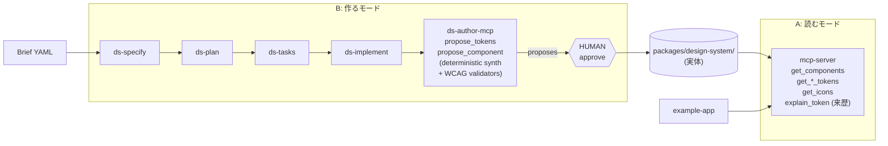

# design-system-mcp-playground

**「設計思想・ブランドカラー → デザインシステム」を AI（GitHub Copilot）に作らせる PoC リポジトリ**。
Ubie の [デザインシステムを MCP サーバー化した話](https://zenn.dev/ubie_dev/articles/f927aaff02d618) の学習用サンプルから出発し、その先のテーマ「**じゃあ、その元になるデザインシステム自体を AI でどう作るか**」までを一通り動く形でカバーします。

---

## 0. このリポジトリは何をするのか（30 秒）

このリポジトリには **2 つの体験** が同居しています:

| モード             | 入力                                     | 出力                                          | 主な MCP                           |
| ------------------ | ---------------------------------------- | --------------------------------------------- | ---------------------------------- |
| **A. 読むモード**  | 「このフォームを作って」                 | DS 準拠の React コード                        | `mcp-server` (ds-read)             |
| **B. 作るモード**  | Brand Brief（設計思想・ブランドカラー）  | デザインシステム（tokens / Button / 来歴メタ） | `ds-author-mcp` + 人間の approve   |

A は元記事と同じ「AI に既存 DS を正確に渡す」体験。B はその DS 自体を AI に Brief から生成させる新しい体験で、**Spec-driven**（specify → plan → tasks → implement）と **決定論的 synth** と **人間専用の approve ゲート** を組み合わせて、AI に「危険なレベルの自由度」を与えずに DS を立ち上げられることを示します。



---

## 1. リポジトリ構成

```
design-system-mcp-playground/
├── packages/
│   ├── design-system/          # 題材デザインシステム（手書き + Brief から生成された両方を保持）
│   │   ├── src/components/     # Button / TextField / Stack（元記事の手書き DS）
│   │   ├── src/tokens/         # color/radius/typography/spacing.json
│   │   ├── src/icons/          # *.svg + icons.json
│   │   ├── src/generated/      # ds-author-mcp が生成した Brief 派生 DS
│   │   │   ├── aurora/         # tokens.json + tokens.css + tokens.provenance.json + Button/
│   │   │   └── nova/
│   │   └── .storybook/
│   │
│   ├── mcp-server/             # ★ ds-read MCP（Copilot に DS を読ませる側）
│   │   └── src/tools/          # get_components / get_*_tokens / explain_token …
│   │
│   ├── ds-author-mcp/          # ★ ds-author MCP（Brief → 提案を書く側）
│   │   └── src/
│   │       ├── synth/          # 決定論的 token 合成（OKLCH + WCAG）+ provenance
│   │       ├── components/     # Button のテンプレ生成（決定論）
│   │       ├── validators/     # schema / contrast / CSS leak チェック
│   │       └── bin/ds-check.js # 単体 CLI（approve からも呼ばれる）
│   │
│   ├── brand-brief/            # ★ Brief スキーマ・例・approve スクリプト
│   │   ├── schema/brief.schema.json
│   │   ├── examples/aurora.brief.yaml / nova.brief.yaml
│   │   ├── proposals/          # ds-author-mcp が書き出す提案物の置き場
│   │   └── bin/ds-approve.mjs  # ★ 人間専用の最終ゲート（MCP 公開なし）
│   │
│   └── example-app/            # Vite + React の動作デモ（A モード用）
│
├── .github/
│   ├── skills/                 # ★ Copilot CLI の Skill (.md) — A の真ソース
│   │   └── ds-{specify,plan,tasks,implement}/SKILL.md
│   ├── agents/
│   │   └── design-system-architect.md   # ★ 構造的 allowlist（edit/bash なし）
│   ├── extensions/
│   │   └── ds-guardrail/       # postToolUse フックで auto-repair / 検証
│   └── prompts/                # VS Code Copilot Chat の slash-command（自動生成）
│
├── scripts/sync-vscode.mjs     # Skill → VS Code prompt の派生生成器
├── .vscode/mcp.json            # ds-read + ds-author の両サーバー登録済み
└── docs/how-it-works.md        # 元記事レイヤーの仕組み解説
```

---

## 2. クイックスタート

### セットアップ

```bash
npm install
npm run build           # 全 workspace をビルド
```

これで `packages/{mcp-server,ds-author-mcp}/dist/` が用意され、VS Code で開けば両 MCP が Copilot Chat (Agent モード) に自動認識されます。

### A. 既存 DS を AI に使わせる（元記事の体験）

```bash
# 1. example-app 起動
npm run dev --workspace @design-system-mcp-playground/example-app
# → http://localhost:5173

# 2. 別ターミナルで Storybook（見本との照合用）
npm run storybook
# → http://localhost:6006
```

`packages/example-app/src/App.tsx` を VS Code で開き、Copilot Chat を **Agent モード** にして:

> 「ユーザー登録フォームを **このデザインシステム** で作って。名前・メール・年齢の入力欄と送信ボタン、簡易バリデーションつき。」

AI が `get_components` → `get_component { name: "Button" }` → `get_color_tokens` … と順に MCP を叩きながら `<RegisterForm />` を実装します。Storybook の見本と並べて、同じ角丸・同じ色・同じフォーカスリングなら成功。

### B. Brief から DS を AI に作らせる（新モード）

事前準備として MCP Inspector を使うのが一番早いです:

```bash
npm run inspect:mcp                    # ds-read 側
# 別タブで:
node packages/ds-author-mcp/dist/index.js | npx @modelcontextprotocol/inspector
```

#### B-1. CLI で動かす（Copilot CLI / `gh copilot`）

```bash
# Spec-driven の流れ（Skill が誘導）
/ds-specify                # → 対話で Brief を埋め、packages/brand-brief/proposals/ に YAML 保存
/ds-plan                   # → どの token・component を作るかの計画
/ds-tasks                  # → 機械的に実行可能な task に分解
/ds-implement              # → ds-author MCP の propose_tokens / propose_component を順に呼ぶ
```

`ds-implement` は AI が `propose_*` で **提案ファイルだけ** を `packages/brand-brief/proposals/<slug>/<id>/proposed/...` に書き出します。`packages/design-system/` への書き込みは **人間が** 以下を実行して初めて起こります:

```bash
npm run ds:approve -- packages/brand-brief/proposals/<slug>/<id>
# → schema + WCAG + CSS リーク を再検証 → コピー → git add
```

#### B-2. VS Code で動かす

`.vscode/mcp.json` で両 MCP が登録済み。Copilot Chat を Agent モードにし、`/ds-specify` ... の各 prompt（`.github/prompts/` の派生ファイル）を順に投げれば同じフローが走ります。Skill (CLI 真) を編集したら:

```bash
npm run sync:vscode
```

を実行すると `.github/prompts/*.prompt.md` が再生成されます（CLI のツール名 → VS Code 形式に翻訳）。

#### B-3. Brief を直接渡す（人間が一気通貫させる）

対話を飛ばして既存サンプルで動きを確認するなら:

```bash
# トークンだけ提案
npm run ds:synth -- packages/brand-brief/examples/aurora.brief.yaml

# 静的検証だけ走らせる（schema / WCAG / CSS leak）
npm run ds:check -- packages/design-system/src/generated/aurora/tokens.json
```

承認済みの aurora / nova は既に `packages/design-system/src/generated/` に入っているので、**A モードのデモから `brief: "aurora"` 引数つきで** ツールを呼べば、Brief から生まれた DS の見本がそのまま読み出せます。

---

## 3. 提供する MCP ツール一覧

### 3.1 `mcp-server` — ds-read（読むモード）

| Tool                    | 入力              | 役割                                                                                                  |
| ----------------------- | ----------------- | ----------------------------------------------------------------------------------------------------- |
| `get_briefs`            | なし              | ds-author-mcp が生成した Brand Brief 一覧（slug / version / generatedAt）                             |
| `get_components`        | `brief?`          | コンポーネント名・概要・タグ一覧。`brief` 指定で生成版を返す                                          |
| `get_component`         | `name`, `brief?`  | 指定コンポーネントの README（props / examples / tokens / related）                                   |
| `get_color_tokens`      | `brief?`          | カラートークン。`brief` 指定で light/dark role pair を平坦化                                          |
| `get_radius_tokens`     | `brief?`          | 角丸トークン                                                                                          |
| `get_typography_tokens` | `brief?`          | 文字サイズ・行間・weight                                                                              |
| `get_spacing_tokens`    | `brief?`          | 余白トークン                                                                                          |
| `get_icons`             | `query?`          | アイコン一覧（SVG ソースつき）。クエリで部分一致フィルタ                                              |
| `explain_token`         | `brief`, `path`   | 指定トークンが Brief のどのフィールド由来かを返す（value / source / input / derivation + briefSha）   |

- `get_components` → `get_component` の二段構えは AI のコンテキスト節約のため。
- `brief` 引数を省略すると **手書きの legacy DS** を返すので、A モードのデモはそのまま動きます。
- `explain_token` は `tokens.json` の隣に出る `tokens.provenance.json` を参照。AI／人間どちらも「この色値はどの Brief 行に紐づくか」を逆引きでき、決定論性と監査性の証拠になります。

### 3.2 `ds-author-mcp` — ds-author（作るモード）

| Tool                | 入力                                       | 役割                                                                                |
| ------------------- | ------------------------------------------ | ----------------------------------------------------------------------------------- |
| `propose_tokens`    | `briefPath`                                | Brief を読み、全トークンを決定論的に合成 → `proposals/<slug>/<id>/` に書き出す     |
| `propose_component` | `briefPath`, `name`, `variants[]`, `sizes[]` | 該当 Brief で Button を生成（テンプレ）。AI の自由度は variants/sizes 選択のみ      |
| `list_proposals`    | なし                                       | 既存の提案一覧を返す                                                                |

**重要**: `ds-author-mcp` には **approve / write / delete に相当するツールが存在しません**。書き出すのは `packages/brand-brief/proposals/` 配下のみで、`packages/design-system/` への反映は人間が `npm run ds:approve` を実行して初めて起こります。

---

## 4. アーキテクチャの安全境界（なぜ AI が暴走しないか）

| 防壁                          | 何を阻止しているか                                          | 場所                                                  |
| ----------------------------- | ----------------------------------------------------------- | ----------------------------------------------------- |
| **Agent allowlist**           | AI が `bash`/`edit`/`create` を呼べない（構造的不可能）     | `.github/agents/design-system-architect.md`           |
| **MCP の役割分離**            | 書く側 (ds-author) は提案ディレクトリにしか書けない         | `packages/ds-author-mcp/` に approve tool が無い      |
| **決定論的 synth**            | 色・余白・タイポは LLM ではなく OKLCH/比率/テーブルで計算   | `packages/ds-author-mcp/src/synth/`                   |
| **コンポーネント・テンプレ**  | TSX は固定テンプレ生成。LLM の自由度は variants/sizes のみ  | `packages/ds-author-mcp/src/components/button.ts`     |
| **WCAG 検証 (二重)**          | propose 時 + approve 時に role-pair contrast を再チェック   | `packages/ds-author-mcp/src/validators/`              |
| **ds-approve の path 白リスト** | 提案の `manifest.changes[].to` は `packages/design-system/` 配下のみ許可 | `packages/brand-brief/bin/ds-approve.mjs`             |
| **ds-guardrail Hook**         | postToolUse で禁止パスへの読み書きを検知し追加検証          | `.github/extensions/ds-guardrail/extension.mjs`       |
| **per-token provenance**      | 全 token に出所メタを付与し、後から誰でも逆引き可能         | `tokens.provenance.json` + `explain_token` MCP        |

つまり「AI が直接 `packages/design-system/` を書き換える」ルートが **構造的に存在しない** のがこの PoC の肝です。

---

## 5. カスタマイズ層（Skills / Custom Agent / MCP / Hooks）

各層が責務をきれいに分けています:

| 層            | 責務                                              | このリポジトリでの実装                                         |
| ------------- | ------------------------------------------------- | -------------------------------------------------------------- |
| **Skill**     | 「何を、どの順で」やるかの workflow（自然言語）   | `.github/skills/ds-{specify,plan,tasks,implement}/SKILL.md`    |
| **Custom Agent** | AI に許可するツール集合（権限境界）             | `.github/agents/design-system-architect.md` (`tools:` allowlist) |
| **MCP**       | 構造化された I/O（read / propose / explain）      | `mcp-server`, `ds-author-mcp`                                  |
| **Hooks**     | 横断的な検証・ログ・auto-repair                   | `.github/extensions/ds-guardrail/extension.mjs` (postToolUse)  |
| **Human**     | 反映の最終ゲート（CI と同等の役割）               | `npm run ds:approve` (`packages/brand-brief/bin/ds-approve.mjs`) |

Skill は CLI 真。VS Code 用 prompt files は `npm run sync:vscode` で派生生成されます。

---

## 6. 主な npm scripts

| コマンド                    | 役割                                                                                          |
| --------------------------- | --------------------------------------------------------------------------------------------- |
| `npm run build`             | 全 workspace をビルド                                                                         |
| `npm run build:mcp`         | ds-read MCP のみビルド                                                                        |
| `npm run build:author-mcp`  | ds-author MCP のみビルド                                                                      |
| `npm run inspect:mcp`       | MCP Inspector で ds-read を対話的にテスト                                                     |
| `npm run storybook`         | デザインシステムの公式見本を起動                                                              |
| `npm run ds:validate -- <brief.yaml>` | Brief を schema validation                                                          |
| `npm run ds:synth -- <brief.yaml>`    | Brief から token を合成（CLI 単体実行）                                            |
| `npm run ds:check -- <tokens.json>`   | tokens.json を schema + WCAG で検証                                                |
| `npm run ds:approve -- <proposal-dir>` | **人間専用**: 提案を `packages/design-system/` に反映                            |
| `npm run sync:vscode`       | Skill から VS Code prompt files を再生成                                                      |

---

## 7. デモ用プロンプト集

### A モード（既存 DS を使わせる）

1. **新規 UI 生成**: 「ユーザー登録フォームを **このデザインシステム** で作って。」
2. **既存スタイルの統一**: 「下記の JSX を、このデザインシステムのコンポーネントとトークンだけ使ってリファクタして。」
3. **アイコン込み**: 「`+` 追加ボタンを、このデザインシステムのアイコンとボタンで実装して。」
4. **意図的なはずし**: 「ステッパー（ウィザード）を作って。」 — DS に無いので精度が落ちることを確認。

### B モード（Brief から DS を作らせる）

1. **Brief 収集**: `/ds-specify` を起動し、「カジュアルなフィットネスアプリ向けのデザインシステムを作りたい。プライマリは緑系で、丸めはやや強め…」と話す。
2. **計画 → タスク → 実装**: `/ds-plan` → `/ds-tasks` → `/ds-implement` で順に進める。
3. **逆引き**: できたあとに `explain_token { brief: "<slug>", path: "color.brand.primary.light" }` を呼んで来歴を確認。
4. **検証**: `npm run ds:check -- packages/design-system/src/generated/<slug>/tokens.json` で WCAG が緑であることを確認。

ツール呼び出しログ（Copilot Chat の "Used N tools" 展開）で実際に `propose_tokens` → `propose_component` の順に呼ばれていれば成功です。

---

## 8. 自社デザインシステムへの導入

最小構成（A モードのみ移植）なら 3 ステップ:

1. `packages/mcp-server/` をコピー
2. `loaders/paths.ts` の参照先を自社の `tokens` / `components` / `icons` に向ける
3. コンポーネントごとに `README.md` を整備（このリポの Button/TextField/Stack をテンプレに）

B モード（Brief 起点）まで持ち込むなら、追加で:

4. `packages/brand-brief/` の Brief schema を自社の意思決定軸に合わせて修正
5. `packages/ds-author-mcp/src/synth/` の決定論ロジックを社内ガイドラインに合わせる（既存色から hue を抽出する等）
6. `.github/agents/` `.github/skills/` `.github/extensions/` を自社の他リポジトリと整合する形に複製

詳しい仕組みは [`docs/how-it-works.md`](./docs/how-it-works.md) を参照してください。

---

## 9. スコープ外（将来の拡張余地）

- **Figma 連携**: Storybook を SSoT、Figma は探索・索引に振る運用（`@storybook/addon-designs` / Storybook Connect で双方向リンク）。
- **コンポーネントの拡張**: 現在 `propose_component` は Button のみ。TextField / Select / Modal などへ拡張。
- **リモート MCP / 認証**: 社内共通サーバーとして配るなら HTTP/SSE + auth。
- **インクリメンタル更新**: ファイル監視で変更時のみ再ロード。
- **Brief の対話 UI**: `/ds-specify` を CLI/Chat 以外にも Web UI として提供。

---

## 10. 参考

- 元記事: [デザインシステムを MCP サーバー化したら、UI 開発が劇的にかわった話](https://zenn.dev/ubie_dev/articles/f927aaff02d618) — Ubie 江崎さん
- [Model Context Protocol 公式](https://modelcontextprotocol.io/)
- [@modelcontextprotocol/sdk (TypeScript)](https://github.com/modelcontextprotocol/typescript-sdk)
- [GitHub Copilot CLI](https://docs.github.com/en/copilot/concepts/agents/about-copilot-cli)
- [GitHub Spec Kit](https://github.com/github/spec-kit) — このリポの `ds-{specify,plan,tasks,implement}` の発想元
