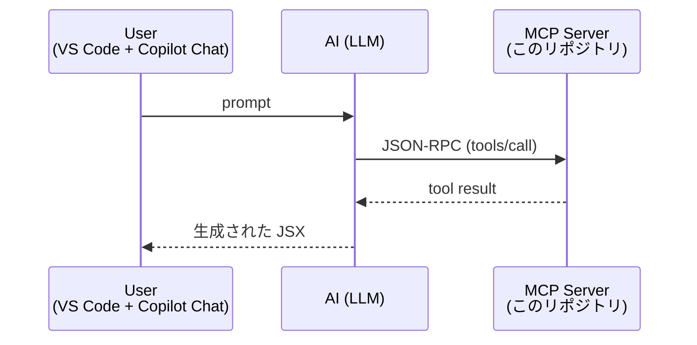

# どのように動いているのか

クライアント説明用に、**MCP の概念**と **このリポジトリの実装** を対応付けて解説します。

## 1. MCP の 3 ロール

- **MCP Client**: GitHub Copilot Chat (VS Code) を主に想定。他にも Claude Desktop / Copilot CLI / Cursor など主要な AI コーディング環境はだいたい MCP に対応しています。MCP サーバーを子プロセスとして起動し、stdio で JSON-RPC をやりとり。
- **AI (LLM)**: クライアントの内部にいる。プロンプトを見て「どのツールをどんな引数で呼ぶか」を自分で決める。
- **MCP Server**: 知識領域（ここではデザインシステム）に特化したツールを公開する。

ポイントは **AI 側が能動的にツールを選ぶ**ことです。Copilot の custom instructions や node_modules 参照のように "事前に context を全部渡す" のではなく、**必要に応じて引きにくる**ので、無駄なトークンを消費せず、しかも最新の情報を取れます。

## 2. このリポジトリの起動シーケンス

1. ユーザーが VS Code の Copilot Chat (Agent モード) で「ユーザー登録フォームを作って」とプロンプト
2. Copilot が起動済みの MCP サーバー (`design-system-mcp-playground`) に `tools/list` を投げ、ツール定義（名前 + description + 入力スキーマ）を取得
3. AI が description を見て「まずデザインシステムで何が使えるか知るべきだ」と判断 → `get_components` を呼ぶ
4. サーバーが `packages/design-system/src/components/*/README.md` を走査して `[{name, summary, tags}]` を返す
5. AI が「Button と TextField と Stack を使う」と決める → `get_component({name: "Button"})` 等を呼ぶ
6. サーバーが README 全文を返す（props 表 / examples / 使うトークン）
7. AI が `get_color_tokens` / `get_typography_tokens` / `get_spacing_tokens` / `get_radius_tokens` を呼ぶ
8. アイコンが必要なら `get_icons({query: "add"})` を呼ぶ
9. **以上で集めた情報のみ**を素材に、Copilot が JSX をユーザーのワークスペースに書き出す

実際のログは Copilot Chat の "Used N tools" 表示やツール呼び出しの展開で見られます。

## 3. tool description の重要性

AI がどのツールをいつ呼ぶかは、**ツールの description（自然言語の説明）に強く依存**します。本リポジトリでは:

- `get_components` の description に「**最初に呼んでください**」「詳細は `get_component` で取得」と明示
- `get_color_tokens` には「CSS color や Tailwind の代わりに必ずこのトークンを使ってください」と書く
- `get_icons` には query の使い方を例示

このような **AI への指示書として description を書く**ことが、精度向上の最大の施策です。

## 4. 各ツールがやっていること（実装ファイル）

| Tool | 実装場所 | データソース |
|---|---|---|
| `get_components` | `tools/index.ts` + `loaders/loadComponents.ts` | `packages/design-system/src/components/*/README.md` の `## Summary` / `## Tags` |
| `get_component` | 同上 | README 全文を返す |
| `get_*_tokens` | `tools/index.ts` + `loaders/loadTokens.ts` | `packages/design-system/src/tokens/*.json` |
| `get_icons` | `tools/index.ts` + `loaders/loadIcons.ts` | `packages/design-system/src/icons/icons.json` + `*.svg` |

データソースが **JSON / Markdown / SVG** という静的ファイルだけなのがポイントです。デザイナー / エンジニアが日常的に編集できるものをそのまま MCP の応答にしているので、運用が破綻しにくい。

## 5. なぜこの構成か（設計判断）

- **JSON をトークンの source of truth にした**: TS だと MCP サーバーがコンパイル / 実行依存を持つ必要が出てしまうため。JSON なら `readFile` だけで済む。
- **コンポーネントは README.md に Markdown で書いた**: AI が直接読みやすく、人間も同じドキュメントを読める。Storybook の MDX や JSDoc を流用しても OK。
- **`get_components` と `get_component` を分けた**: 一括で全部返すとコンテキストを消費しすぎる。AI は必要なものだけ詳細展開する。
- **stdio transport**: GitHub Copilot Chat / Claude Desktop / Copilot CLI / Cursor など主要クライアントが共通でサポート。HTTP transport は社内共通サーバー化するときに置き換え可能。
- **Storybook は人間用、MCP は AI 用、ソースは共通**: `packages/design-system/` に Storybook を同梱しています（`npm run storybook`）。Storybook の `*.stories.tsx` も MCP サーバーが返す JSON / README も、参照しているのは同じコンポーネント実装・同じ `tokens/*.json` です。**人間が見る見本（Storybook）と AI が引く知識（MCP）の同期ズレが起きにくい** のが利点。

## 6. クライアントへの導入手順（短縮版）

1. `packages/mcp-server/` を持ち込み、**`loaders/paths.ts` の参照先**を自社デザインシステムのディレクトリに変更
2. **コンポーネントの README** を本リポジトリの形式（`## Summary` / `## Tags` / `## Props` / `## Examples` / `## Related` / `## Design Tokens Used`）で整備
3. **トークンを JSON 化**（既に JSON ならそのまま、TS のみなら build スクリプトで生成）
4. `npm run build:mcp` → MCP クライアントの設定（VS Code なら `.vscode/mcp.json`）に登録

> 補足: Storybook は導入しなくても MCP は動きます。ただし「AI が生成した UI をデザイン通りか見比べる」基準があると検証しやすいので、本リポジトリでは併設しています。

## 7. 限界と運用上の注意

- **MCP に登録されていないコンポーネントは精度が落ちる**（記事のステッパーの例）。網羅性 = 価値。
- **README が雑だと精度も雑**。ドキュメント整備が AI 体験に直結する、というのは強い構造的インセンティブ。
- **トークンの値が複数フォーマット（CSS 変数 / Tailwind class / JS 値）あるなら、それぞれを返すようにツールを増やすのが良い**。
- **破壊的変更**: コンポーネント名を変えると AI が古い名前で呼ぶ可能性がある。alias を `tags` で吸収するのが現実的。
- **README と Storybook stories の二重メンテ**: 現状は `Button.stories.tsx` の examples と `Button/README.md` の examples が独立に書かれている。将来的には stories を AST 解析して README 由来 examples を自動補完することで一本化できる（README の §8 「Storybook 連携」）。
